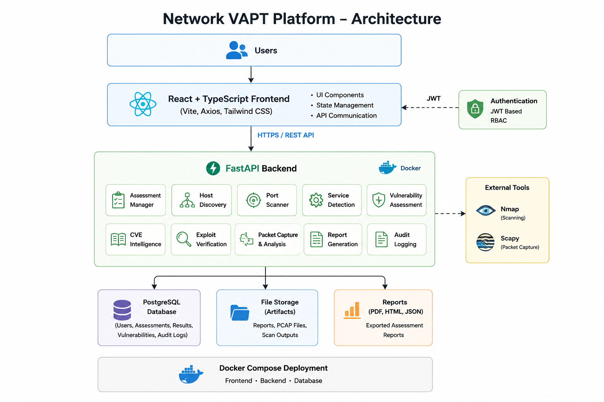

# Network VAPT Platform

> **Internal Network Vulnerability Assessment & Penetration Testing Platform**

A full-stack cybersecurity web application that automates the complete internal network VAPT lifecycle — from host discovery and port scanning through vulnerability assessment, CVE intelligence, exploit verification, and packet analysis — ending with professional executive, technical, and compliance reports.

Built on **FastAPI + PostgreSQL 16** (backend) and **React 18 + TypeScript** (frontend), with pluggable **Nmap / OpenVAS** scanning, **Metasploit RPC** exploitation, and **Wireshark (dumpcap/tshark)** packet capture — all behind role-based access control with a complete audit trail.

## Project Badges

[](https://github.com/prashanth0301/Network-VAPT-Internal-Lab/releases)
[](LICENSE)
[](https://python.org)
[](https://fastapi.tiangolo.com)
[](https://www.sqlalchemy.org)
[](https://react.dev)
[](https://www.typescriptlang.org)
[](https://vitejs.dev)
[](https://postgresql.org)
[](https://docker.com)
[](https://www.metasploit.com)
[]()

---

## Table of Contents

- [Features](#features)
- [Architecture](#architecture)
- [Technology Stack](#technology-stack)
- [Folder Structure](#folder-structure)
- [Screenshots](#screenshots)
- [Installation](#installation)
- [Running with Docker](#running-with-docker)
- [Running Locally](#running-locally)
- [Default Credentials & First Login](#default-credentials--first-login)
- [API Documentation](#api-documentation)
- [Version 1.0 Features](#version-10-features)
- [Testing](#testing)
- [Future Roadmap](#future-roadmap)
- [License](#license)
- [Ethical Use](#ethical-use)

---

## Features

- **6-Stage Assessment Pipeline** — Host Discovery → Port Scan → Service Intelligence → Vulnerability Assessment → CVE Intelligence → Exploit Verification, orchestrated by a pluggable stage engine with weighted progress tracking.
- **Real-Time Dashboard** — overall risk score, severity distribution, vulnerability trends, top ports, service distribution, top vulnerable hosts, and an activity timeline.
- **Assessment Selector** — scope every dashboard widget to a single active assessment.
- **Scanner Integration** — pluggable Nmap and OpenVAS backends via the `VulnerabilityScanner` interface.
- **CVE Intelligence** — NVD enrichment, EPSS scoring, KEV status, and vendor/product mapping.
- **Exploit Verification** — Metasploit RPC module matching, exploit execution, and session tracking.
- **Port Scanning & Service Enumeration** — TCP SYN / UDP scans, version detection, OS fingerprinting, banner grabbing, and service identification.
- **Packet Analysis** — live capture, PCAP upload, protocol distribution, conversation tracking, and a timestamped packet viewer with automatic network interface detection.
- **Report Generation** — Executive, Technical, and Compliance reports exported as **JSON, HTML, and PDF**.
- **Global Search** — expanded server-side search across reports, services, hosts, assessment history, and audit logs.
- **User Management** — RBAC with **3 roles** (`administrator`, `security_analyst`, `viewer`) and **9 granular permissions**.
- **Audit Logging** — complete audit trail with CSV/JSON export.
- **Health & Diagnostics** — `/api/v1/health` endpoint, structured JSON logging (Loguru), and Pydantic v2 validated configuration.

---

## Architecture



> **Note:** `docs/images/architecture.png` is a placeholder. Replace it with the rendered architecture diagram before publishing.

The platform follows a clean three-tier architecture:

```
+---------------------------------------------------+
|                    Frontend                        |
|  React 18 · TypeScript · Vite · Tailwind CSS      |
|  20 pages · 18 services · 12 type modules         |
|  Port 5173                                         |
+-------------------------+-------------------------+
                          | HTTP (REST, JWT)
+-------------------------v-------------------------+
|                     Backend                         |
|  FastAPI · SQLAlchemy 2.0 (async) · Pydantic v2   |
|  94 endpoints · 16 routers · 23+ services         |
|  Port 8000                                          |
+-------------------------+-------------------------+
                          | asyncpg (connection pool)
+-------------------------v-------------------------+
|                   Database                          |
|  PostgreSQL 16 · 17 tables · UUID PKs             |
|  Port 5432 (Docker network only)                  |
+-------------------------+-------------------------+
                          |
+-------------------------v-------------------------+
|                 Scanner Layer                       |
|  Nmap · OpenVAS · Metasploit · Wireshark          |
+---------------------------------------------------+
```

**Design principles:**

- **Layered service pattern** — routers handle validation and auth; service modules hold business logic; SQLAlchemy models provide data access.
- **Pluggable scanners** — the abstract `VulnerabilityScanner` interface allows Nmap / OpenVAS to be swapped or extended without touching the pipeline.
- **UUID primary keys** — all 17 tables use server-generated UUID v4 keys.
- **Background scanning** — long-running stages execute as background tasks with client-side progress polling.

---

## Technology Stack

| Layer | Technology |
|-------|-----------|
| **Frontend** | React 18, TypeScript 5, Vite 5, Tailwind CSS, Recharts, React Router v6, Axios |
| **Backend** | FastAPI 0.115+, Python 3.11+, SQLAlchemy 2.0 Async, Pydantic v2, Loguru |
| **Database** | PostgreSQL 16, asyncpg, Alembic migrations |
| **Scanning** | Nmap 7.94+, OpenVAS (pluggable via `VulnerabilityScanner`) |
| **Exploitation** | Metasploit Framework 6.x (msfrpcd RPC) |
| **CVE Intelligence** | NVD API, EPSS scoring, KEV catalog |
| **Packet Capture** | dumpcap / tshark (Wireshark), Npcap, scapy, psutil |
| **Reporting** | Jinja2 templates, Markdown, ReportLab (PDF) |
| **Deployment** | Docker, Docker Compose (backend, frontend, PostgreSQL, lab targets) |
| **Virtualization (lab)** | VirtualBox 7+ / VMware Workstation Pro |
| **Quality & CI** | GitHub Actions, Black, Ruff, isort, mypy, pre-commit |

---

## Folder Structure

```
Network-VAPT-Internal-Lab/
├── backend/                  # FastAPI application
│   ├── app/
│   │   ├── api/v1/           # 16 API routers, 94 endpoints
│   │   ├── core/             # Config, database, dependencies, logging
│   │   ├── models/           # SQLAlchemy ORM models (17 tables)
│   │   ├── schemas/          # Pydantic v2 validation schemas
│   │   ├── services/         # Business logic (23+ modules)
│   │   │   └── assessment/   # 6-stage pipeline engine
│   │   └── main.py           # FastAPI app with lifespan events
│   ├── alembic/              # Database migrations
│   ├── tests/                # Pytest suite (647 tests)
│   └── requirements*.txt     # Core / dev / security dependencies
├── frontend/                 # React + TypeScript application
│   ├── src/
│   │   ├── components/       # Layout + reusable UI components
│   │   ├── context/          # Theme + Toast providers
│   │   ├── hooks/            # Custom React hooks
│   │   ├── pages/            # 20 page views
│   │   ├── services/         # Axios API client (18 services)
│   │   ├── types/            # TypeScript type definitions
│   │   └── router/           # Route definitions
│   ├── vite.config.ts        # Dev proxy /api → :8000
│   └── tailwind.config.js
├── docker/                   # Docker Compose + Dockerfiles
│   ├── docker-compose.yml
│   ├── backend.Dockerfile
│   └── db/ frontend/ lab/ kali/
├── docs/                     # Architecture, API, install, user docs
├── reports/                  # Generated report output files
├── screenshots/              # Screenshots for this README / releases
├── captures/                 # PCAP capture files
├── wireshark/                # Wireshark configuration / captures
├── artifacts/                # Per-stage scan artifacts
├── automation/               # Automation scripts
├── scripts/                  # Utility scripts (e.g. create_admin)
├── database/                 # Schema migrations and scripts
├── .github/workflows/        # CI/CD pipeline
├── .env.example              # Environment template
└── README.md
```

---

## Screenshots

> Placeholders — drop real captures into `screenshots/` and update the paths before publishing.

| Section | Screenshot |
|---|---|
| Dashboard |  |
| Assessment Workflow |  |
| Assessment History |  |
| Hosts |  |
| Services |  |
| Vulnerabilities |  |
| Exploit Verification |  |
| Packet Analysis |  |
| Reports |  |
| Audit Logs |  |
| User Management |  |

---

## Installation

### System Requirements

| Component | Minimum |
|---|---|
| CPU | 4 cores |
| RAM | 8 GB (16 GB recommended for virtual lab) |
| Disk | 20 GB free |
| Network | Adapter with access to target networks |

### Prerequisites

| Software | Version |
|---|---|
| Docker | 24.0+ |
| Docker Compose | v2.20+ |
| Git | 2.30+ |
| Python (local dev only) | 3.11+ |
| Node.js (local dev only) | 20+ |

### Environment Setup

```bash
# 1. Clone the repository
git clone <repository-url>
cd Network-VAPT-Internal-Lab

# 2. Copy the environment template and set secrets
cp .env.example .env
```

Edit `.env` and set at least the following (both are required by Docker Compose):

| Variable | Description |
|---|---|
| `POSTGRES_PASSWORD` | PostgreSQL password (change from the default) |
| `JWT_SECRET` | Secret used to sign access/refresh tokens (use a long random string) |

```bash
# 3. Build and start all services
cd docker
docker compose --env-file ..\.env up -d --build

# 4. Verify
docker ps --filter "name=vapt"
curl http://localhost:8000/api/v1/health
```

---

## Running with Docker

```bash
cd docker
docker compose --env-file ..\.env up -d --build     # start
docker compose --env-file ..\.env ps                # status
docker compose --env-file ..\.env logs -f backend   # backend logs
docker compose --env-file ..\.env down              # stop
```

### Containers

| Container | Port | Purpose |
|---|---|---|
| `vapt-db` | 5432 (Docker network only) | PostgreSQL 16 database |
| `vapt-backend` | 8000 | FastAPI backend (auto-bootstraps schema + admin) |
| `vapt-frontend` | 5173 | React SPA production build served by `serve` |
| `vapt-vulnapache` | — | Vulnerable Apache target for lab testing |
| `vapt-ftp` | — | FTP service for lab testing |

### Access Points

| Service | URL |
|---|---|
| Frontend | `http://localhost:5173` |
| Backend API | `http://localhost:8000` |
| Swagger UI | `http://localhost:8000/docs` |
| ReDoc | `http://localhost:8000/redoc` |
| Health Check | `http://localhost:8000/api/v1/health` |

---

## Running Locally

### Backend (Terminal 1)

```bash
cd backend
python -m venv .venv
.venv\Scripts\Activate.ps1   # Windows
# source .venv/bin/activate  # Linux / macOS

pip install -r requirements.txt

# Optional integrations (nmap, OpenVAS, PDF reports)
pip install -r requirements-security.txt

# Development / testing tools
pip install -r requirements-dev.txt

# Ensure PostgreSQL is running with database 'vapt_db', then:
cp ../.env.example .env
alembic upgrade head

uvicorn app.main:app --reload --host 0.0.0.0 --port 8000
```

### Frontend (Terminal 2)

```bash
cd frontend
npm install
npm run dev
```

The Vite dev server proxies `/api` requests to `http://localhost:8000`.

### Testing

```bash
# Backend (from backend/)
pip install -r requirements-dev.txt
pytest tests/ -v --asyncio-mode=auto      # 647 tests

# Frontend
cd frontend
npm run build
```

---

## Default Credentials & First Login

On first startup the backend **automatically creates a default administrator** when the `users` table is empty (disable with `AUTO_CREATE_ADMIN=false`):

| Field | Value |
|-------|-------|
| Username | `admin` |
| Email | `admin@networkvapt.local` |
| Password | `Admin@123` |
| Role | `administrator` |

Override via `ADMIN_USERNAME` / `ADMIN_EMAIL` / `ADMIN_PASSWORD` in `.env`.

> **Important:** Change the default password immediately in any non-isolated environment.

To (re)seed the admin or create additional users idempotently:

```bash
cd backend
python -m scripts.create_admin --username operator1 --password SecurePass@456
```

Get an admin token:

```bash
curl -X POST http://localhost:8000/api/v1/auth/login \
  -H "Content-Type: application/json" \
  -d '{"username": "admin", "password": "Admin@123"}'
```

### Roles

| Role | Permissions |
|---|---|
| `administrator` | Full access (9 permissions) |
| `security_analyst` | Scan, view/export reports, view audit logs (5 permissions) |
| `viewer` | Read-only (view dashboards and reports) |

---

## API Documentation

Interactive API documentation is served by the backend while it is running:

- **Swagger UI:** `http://localhost:8000/docs`
- **ReDoc:** `http://localhost:8000/redoc`
- **OpenAPI JSON:** `http://localhost:8000/openapi.json`
- **Health Check:** `GET http://localhost:8000/api/v1/health`

The OpenAPI schema covers **94 endpoints across 16 routers** (auth, users, assessments, hosts, ports, services, vulnerabilities, CVEs, exploits, captures, reports, dashboard, audits, settings, and health). Additional reference material lives in `docs/API_DOCUMENTATION.md` and `docs/API.md`.

---

## Version 1.0 Features

This release (`v1.0.0`) marks the **complete** Network VAPT Platform:

- Full **6-stage assessment pipeline** with background execution, per-stage progress, and searchable assessment history.
- **Real-time dashboard** with risk scoring, severity distribution, vulnerability trends, top ports/services/hosts, and an activity timeline.
- **Host discovery** with OS fingerprinting and MAC/vendor enrichment.
- **Port scanning** with Nmap profiles (quick / standard / deep / custom) and service/banner detection.
- **Vulnerability assessment** via Nmap and OpenVAS with CVSS scoring.
- **CVE intelligence** — NVD enrichment, EPSS scores, and KEV status.
- **Exploit verification** via Metasploit RPC with session tracking.
- **Packet analysis** — live capture, PCAP upload, protocol/conversation analysis, and automatic interface enumeration (name, IP, MAC, Up/Down status).
- **Report generation** — Executive / Technical / Compliance in JSON, HTML, and PDF.
- **Expanded global search** across reports, services, hosts, assessment history, and audit logs (server-side, case-insensitive, paginated).
- **RBAC** — 3 roles, 9 permissions, permission-gated endpoints.
- **Audit logging** — complete trail with CSV/JSON export.
- **Docker Compose deployment** with lab target containers.
- **647 automated backend tests** passing.

---

## Future Roadmap

### v1.1

- Scheduled & recurring scans with email digests
- Vulnerability lifecycle (open / accepted / false-positive) with comments and assignees
- Report scheduling and custom report template editor
- Delta/comparison between assessments (new vs. fixed vulnerabilities)
- SMTP notifications and MFA (TOTP)
- MITRE ATT&CK technique mapping
- Bulk CSV import/export of users and findings

### v2.0

- Multi-tenant / multi-organization support
- Distributed scanning agents with a Redis/Celery task queue
- Horizontal scaling and database read replicas
- S3-compatible object storage for reports and captures
- Public API tokens and webhooks
- Compliance report templates (NIST CSF, ISO 27001, PCI-DSS, SOC 2)
- WebSocket-driven real-time telemetry
- Third-party threat-intelligence feeds and threat-hunting queries

---

## License

This project is licensed under the **MIT License**. See [LICENSE](LICENSE) for details.

## Ethical Use

This platform is designed exclusively for **educational and authorized penetration testing** within isolated laboratory environments. Unauthorized use against systems without explicit permission is illegal.
