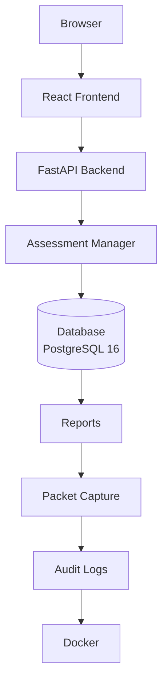
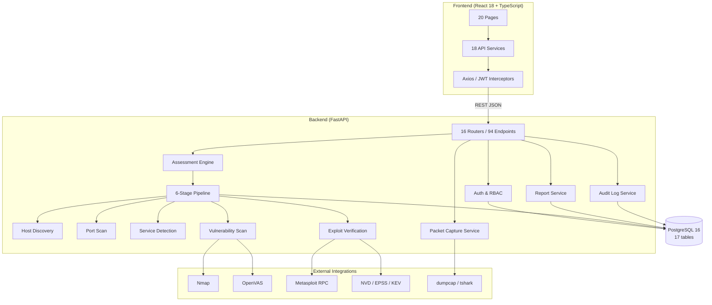
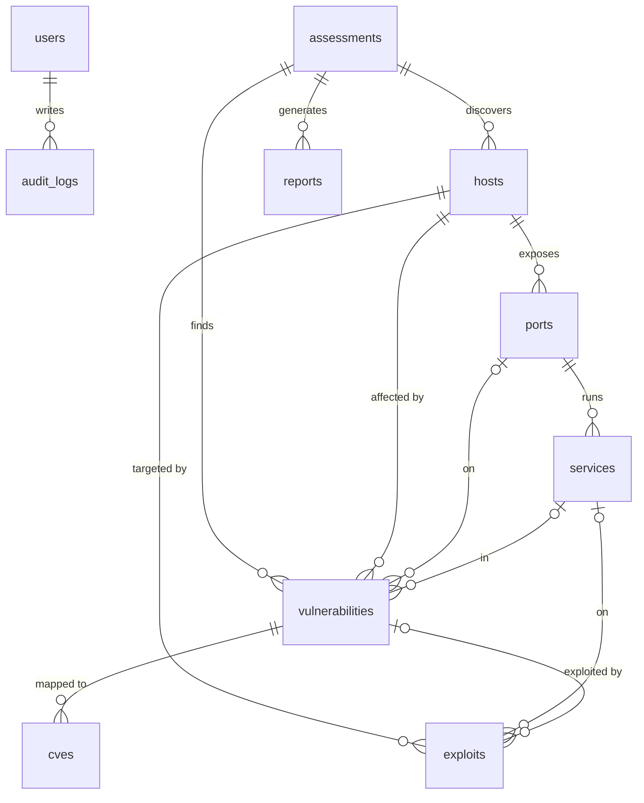

# Network VAPT Platform — Architecture

System architecture of the Internal Network Vulnerability Assessment & Penetration Testing Platform (v1.0).

---

## 1. System Flow



---

## 2. Container Diagram

```mermaid
flowchart LR
    subgraph Docker["Docker Compose Environment"]
        DB[(vapt-db\nPostgreSQL 16\n:5432 internal)]
        BE[vapt-backend\nFastAPI + Uvicorn\n:8000]
        FE[vapt-frontend\nReact SPA (serve)\n:5173]
        LAB1[vapt-vulnapache\nVulnerable Apache target]
        LAB2[vapt-ftp\nFTP lab service]
    end

    User[User] -->|HTTP :5173| FE
    FE -->|HTTP /api/v1 :8000| BE
    BE -->|asyncpg :5432| DB
    BE -->|scan| LAB1
    BE -->|scan| LAB2
    BE -.->|reports/ screenshots/ wireshark/| DB
```

---

## 3. Component Diagram



---

## 4. Entity Relationship Diagram



---

## 5. Deployment Notes

- **Frontend:** served as a static production build on port 5173 (dev server proxies `/api` → `:8000`).
- **Backend:** FastAPI + Uvicorn on port 8000; auto-creates schema, seeds settings, and bootstraps the default administrator on first start.
- **Database:** PostgreSQL 16 with 17 tables, UUID primary keys, JSONB scan parameters.
- **Lab targets:** `vapt-vulnapache` and `vapt-ftp` containers simulate vulnerable services for authorized testing.
- **Volumes:** `reports/`, `screenshots/`, `wireshark/`, and backend logs are mounted into the backend container.
